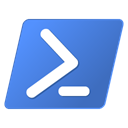
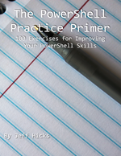

# PowerShell Scripting Patterns and Practices

PowerShell is all about automation. It doesn't matter if you want to automate the provisioning of a new Microsoft 365 account, create a Hyper-V virtual machine, or get system information. You will need to script and you will want to do it the right way. This repository contains material from my [SpiceWorld 2021](https://www.spiceworks.com/spiceworld/) presentation.

The PowerShell script files contain demonstration code. These *are not* files to execute. Open the files in your scripting editor (presumably [VS Code](https://code.visualstudio.com/)) and review. Many of the files contain examples of poor PowerShell scripting followed by suggested improved versions. Hopefully, you can use these "better" versions as models for your own work.

The bonus zip file contains a video file. It is content I recorded but was unable to fit into the final conference session due to time constraints. The PDF version of my slides reflects what I recorded not necessarily the final conference recording.

> All of the material in this repository is offered freely for __educational__ purposes only. Nothing should be considered production-ready.

## :book: Learn More :mortar_board:

In addition to the well-known [_Learn PowerShell in a Month of Lunches_](https://www.manning.com/books/learn-windows-powershell-in-a-month-of-lunches-third-edition?a_aid=jdhit&a_bid=2326a8ab) book, you can find my other work on Leanpub.

|   |   |
|---|---|
 | [_The PowerShell Practice Primer_](https://leanpub.com/psprimer) isn't a book to teach your PowerShell, but rather to re-inforce what you already know through 100+ console-based exercises. No scripting is required. Updated with PowerShell 7.x content.
 | If you have read [_Learn PowerShell Scripting in a Month of Lunches_](https://www.manning.com/books/learn-powershell-scripting-in-a-month-of-lunches?a_aid=jdhit&a_bid=2326a8ab), then you are ready for the next step. Don Jones and I wrote this book intending it to be the definitive guide on everything you need to know to be a better PowerShell scripter and toolmaker.
 | I have been creating video training courses for over ten years. I have a large course catalog at [Pluralsight](https://pluralsight.pxf.io/qbR6n), with an emphasis on PowerShell-related content. If you are just getting started with PowerShell 7, [I got you covered](https://pluralsight.pxf.io/Lbvya) there as well.

-----
